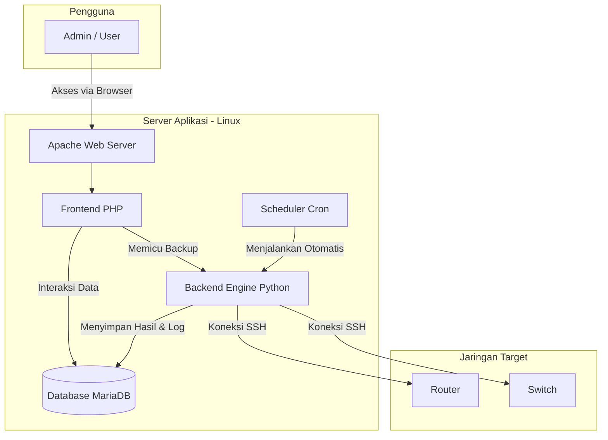

# 🌐 NetBackup — Backup Otomatis Perangkat Jaringan

NetBackup adalah aplikasi web modern yang dikembangkan untuk membantu administrator jaringan melakukan backup konfigurasi perangkat secara otomatis dan terpusat. Dengan antarmuka yang bersih dan responsif, semua backup dari perangkat multi-vendor dapat dikelola dari satu dashboard, dipantau statusnya secara real-time, dan dijadwalkan dengan andal.

---

## ✨ Fitur Utama

- 👤 **Manajemen Pengguna**: Sistem login dengan proteksi session dan peran pengguna (admin & user).  
- 🖧 **Manajemen Perangkat**: Tambah, edit, dan hapus perangkat dengan dukungan multi-vendor (Cisco, Huawei, Juniper, Mikrotik, dll.).  
- ✅ **Status Real-Time**: Pantau status konektivitas perangkat (ICMP & TCP/SSH) langsung dari dashboard.  
- ⏰ **Backup Otomatis & Manual**  
  - **Cron Job Andal**: Penjadwalan backup otomatis (harian, mingguan, bulanan) dijalankan oleh cron job server untuk stabilitas maksimal.  
  - **Backup Sekali Klik**: Tombol backup manual di halaman perangkat untuk kebutuhan mendesak.  
- 📂 **Manajemen Hasil Backup**  
  - Lihat, cari, dan filter semua riwayat backup.  
  - Download konfigurasi dalam format `.txt`.  
  - Aksi massal: hapus atau download beberapa file backup sekaligus.  
- 📜 **Log Aktivitas Terpusat**: Semua aktivitas penting (login, backup, perubahan data) dicatat di database dan dapat dilihat di halaman Log.  
- 🔒 **Keamanan**: Proteksi terhadap CSRF, enkripsi kredensial perangkat, serta *prepared statements* untuk mencegah SQL Injection.  

---

## 🏗️ Informasi Teknis

### Arsitektur Sistem
Aplikasi ini menggunakan arsitektur 3-tier yang memisahkan antara antarmuka pengguna, logika bisnis, dan penyimpanan data.



### Teknologi yang Digunakan
- **Frontend**: PHP 8.2 (Native), HTML5, CSS3  
- **Backend Engine**: Python 3 (Paramiko untuk SSH, Cryptography untuk enkripsi)  
- **Database**: MariaDB 10+ atau MySQL 8+  
- **Web Server**: Apache2 (dengan `mod_rewrite`)  
- **Scheduler**: Cron (Linux)  
- **Sistem Operasi**: Debian 12 (direkomendasikan)  

---

## 📂 Struktur Direktori Aplikasi

```
/var/www/netbackup/
│
├── config/              # File konfigurasi sensitif
│   ├── db.php           # Koneksi database PHP dan fungsi helper
│   └── db_setting.ini   # Kredensial database & kunci enkripsi
│
├── python/              # Skrip backend untuk logika backup
│   ├── backup_single.py         # Backup satu perangkat
│   ├── run_scheduled_backup.py  # Skrip utama untuk cron
│   └── db.py                    # Helper koneksi database (Python)
│
├── sql/                 # Skema database
│   └── schema.sql
│
├── style/               # File CSS global
│   └── global.css
│
├── web/                 # Antarmuka web (PHP)
│   ├── index.php        # Router utama
│   ├── dashboard.php    # Halaman utama setelah login
│   └── includes/        # Komponen UI (header, footer, dll.)
│
├── .htaccess            # Aturan rewrite URL untuk Apache
├── install_server.sh    # Skrip instalasi otomatis
└── README.md            # Dokumentasi
```

---

## 🗄️ Struktur Database

Database **`netbackup_db`** terdiri dari 6 tabel utama:

- **users** — Data pengguna aplikasi  
  - Kolom: `id`, `username`, `password_hash`, `role` (admin/user)  

- **vendor** — Daftar vendor perangkat & command backup spesifik  
  - Kolom: `id`, `name`, `command`  

- **devices** — Daftar semua perangkat yang akan di-backup  
  - Kolom: `id`, `name`, `ip`, `vendor_id`, `username`, `password_enc`  

- **backups** — Riwayat setiap proses backup  
  - Kolom: `id`, `device_id`, `timestamp`, `config`, `status`  

- **settings** — Jadwal backup perangkat  
  - Kolom: `id`, `device_id`, `schedule`, `active`  

- **logs** — Catatan aktivitas sistem  
  - Kolom: `id`, `type`, `actor`, `details`  

---

## 🚀 Panduan Instalasi (Debian 12)

### Prasyarat
- Server dengan Debian 12  
- Akses root/sudo  

### Langkah 1: Unduh Aplikasi & Jalankan Skrip Instalasi
```bash
# Masuk direktori DocumentRoot web server
cd /var/www
# Clone repository
git clone https://github.com/erlanggaalfian/netbackup.git
cd netbackup

# Berikan izin eksekusi pada skrip
chmod +x install_server.sh

# Jalankan skrip instalasi
sudo bash install_server.sh
```

### Langkah 2: Konfigurasi Database (Manual)
Masuk ke MariaDB:
```bash
sudo mysql
```

Buat database & user:
```sql
CREATE DATABASE netbackup_db;
CREATE USER 'mydatabase'@'localhost' IDENTIFIED BY 'password_aman_anda';
GRANT ALL PRIVILEGES ON netbackup_db.* TO 'mydatabase'@'localhost';
FLUSH PRIVILEGES;
EXIT;
```

Impor struktur tabel:
```bash
sudo mysql -u mydatabase -p netbackup_db < /var/www/netbackup/sql/schema.sql
```

### Langkah 3: Konfigurasi Aplikasi
Buat file konfigurasi:
```bash
sudo nano /var/www/netbackup/config/db_setting.ini
```

Isi dengan:
```ini
[database]
DB_HOST = localhost
DB_PORT = 3306
DB_NAME = netbackup_db
DB_USER = mydatabase
DB_PASS = password_aman_anda
ENCRYPTION_KEY = NetBackup_SecureKey_2024_ChangeInProduction
```

### Langkah 4: Konfigurasi Apache
Buat Virtual Host baru:
```bash
sudo nano /etc/apache2/sites-available/netbackup.conf
```

Isi dengan:
```apache
<VirtualHost *:80>
    ServerAdmin webmaster@localhost
    DocumentRoot /var/www/netbackup

    <Directory /var/www/netbackup>
        Options Indexes FollowSymLinks
        AllowOverride All
        Require all granted
    </Directory>

    ErrorLog ${APACHE_LOG_DIR}/netbackup_error.log
    CustomLog ${APACHE_LOG_DIR}/netbackup_access.log combined
</VirtualHost>
```

Aktifkan konfigurasi:
```bash
sudo a2ensite netbackup.conf
sudo a2enmod rewrite
sudo a2dissite 000-default.conf
sudo systemctl restart apache2
```

### Langkah 5: Selesai!
Akses aplikasi melalui browser:  
```
http://alamat-ip-server-anda
```
Buat akun administrator pertama Anda di halaman setup.

---

## 👨‍💻 Author
Dibuat dengan semangat belajar oleh:  
**Erlangga Alfian**  
📧 erlanggaalfian82@gmail.com  
🌐 [GitHub](https://github.com/erlanggaalfian)

---

## 📜 Lisensi
Proyek ini dirilis di bawah **MIT License**.
